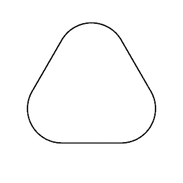

# Circle Morphing

*Computational interpolations from a circle-to-a-square, and circle-to-a-triangle, using [p5.js](p5js.org)*

**THIS SOFTWARE IS NOT FREE. NO COMMERCIAL USE. ATTRIBUTION REQUIRED. BY-NC.**

### References / See Also:

* Dan Shiffman's ["10 Minute Coding Challenges - Shape Morphing"](https://www.youtube.com/watch?v=Md5LIDW0RyY&t=12m35s) (12:35-43:20). 
* Dan Shiffman's ["Coding Challenge #19: Superellipse"](https://www.youtube.com/watch?v=z86cx2A4_3E&t=4m22s) (4:22-12:00).
* [A Book of drawCircle()](http://sfpcyukiy.tumblr.com/post/104067533568/a-book-of-drawcircle) & [Github](https://github.com/yukiy/drawCircle) by [Yuki Yoshida](http://sfpc.io/people/yuki-yoshida/)
* [Squaring the Circle](http://troika.uk.com/work/squaring-the-circle/) and [Dark Matter](https://www.youtube.com/watch?v=5q5G0jP9cTw) by Troika
* [OTTO – Footnotes from the History of Two Cultures: Mitsuo Katsui](https://vimeo.com/129666491) by Jürg Lehni 

--
### Some Ways of Transforming a Circle into a Square

1. ([code](circle-to-square/circle01/sketch.js)) by progressively deleting all points except for the square's corners
2. ([code](circle-to-square/circle02/sketch.js)) by approximating a circle with four Bezier cubic splines and modulating the spline control points
3. ([code](circle-to-square/circle03/sketch.js)) by approximating a circle with four circular arcs whose radii lengthen to infinity
4. ([code](circle-to-square/circle04/sketch.js)) by linearly interpolating points on the circle towards points on the square, along radii of the circle
5. ([code](circle-to-square/circle05/sketch.js)) by progressively moving points evenly sampled along the circle, towards points on the square, resampled at equal intervals, by small random amounts
6. ([code](circle-to-square/circle06/sketch.js)) by treating it as a rounded rect, whose (rounded) corners have a dynamic radius
7. ([code](circle-to-square/circle07/sketch.js)) by treating it as a multisided polygon whose number of sides gradually decreases to four
8. ([code](circle-to-square/circle08/sketch.js)) by gradually flattening the circle on four sides
9. ([code](circle-to-square/circle09/sketch.js)) by gradually shrinking the circle's radius, revealing square corners within
10. ([code](circle-to-square/circle10/sketch.js)) by treating points along the perimeter as a series of springy particles
11. ([code](circle-to-square/circle11/sketch.js)) by considering it as a set of alternating straight lines and arcs in which the arcs shrink while the lines grow
12. ([code](circle-to-square/circle12/sketch.js)) by using a 'superellipse' formula
13.  ([code](circle-to-square/circle13/sketch.js)) by progressively subdividing it into a 4-gon, 8-gon, 16-gon, 32-gon, etc., with smooth interpolations.
14. ([code](circle-to-square/circle14/sketch.js)) by abruptly moving points evenly sampled along the circle, towards corresponding points on the square

--
### Some Ways of Transforming a Circle into a Triangle

0. ([code](circle-to-triangle/circle00/sketch.js)) // by sampling a circle into many vertices, and then locally averaging each point with its neighbors, except for the three special corner vertices.
1. ([code](circle-to-triangle/circle01/sketch.js)) by progressively deleting all points except for the triangle's corners
2. ([code](circle-to-triangle/circle02/sketch.js)) by approximating a circle with three Bezier cubic splines and modulating the spline control points
3. ([code](circle-to-triangle/circle03/sketch.js)) by approximating a circle with three circular arcs whose radii lengthen to infinity
4. ([code](circle-to-triangle/circle04/sketch.js)) by linearly interpolating points on the circle towards points on the triangle, along radii of the circle
5. ([code](circle-to-triangle/circle05/sketch.js)) by progressively moving points evenly sampled along the circle, towards points on the triangle, resampled at equal intervals, by small random amounts
6. ([code](circle-to-triangle/circle06/sketch.js)) by treating it as a rounded triangle, whose (rounded) corners have a dynamic radius
7. ([code](circle-to-triangle/circle07/sketch.js)) by treating it as a multisided polygon whose number of sides gradually decreases to three
8. ([code](circle-to-triangle/circle08/sketch.js)) by gradually flattening the circle on three sides
9. ([code](circle-to-triangle/circle09/sketch.js)) by gradually shrinking the circle's radius, revealing triangular corners within
10. ([code](circle-to-triangle/circle10/sketch.js)) by treating points along the perimeter as a series of springy particles
11. ([code](circle-to-triangle/circle11/sketch.js)) by considering it as a set of alternating straight lines and arcs in which the arcs shrink while the lines grow
12. ([code](circle-to-triangle/circle12/sketch.js)) by treating the form as a series of 6 circular arcs, alternatingly with small and large radii
13.  ([code](circle-to-triangle/circle13/sketch.js)) by progressively subdividing it into a 3-gon, 6-gon, 12-gon, 24-gon, etc., with smooth interpolations.

